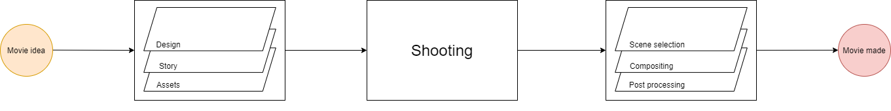
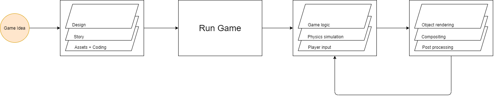

# The art of game development

Hi everyone! Welcome to the first post of a series that will help you get started with game development in Stride.
This series will be for those who have  little experience and knowledge in game development and are trying to decide if Stride is a good for them.

I myself have been in this situation where my knowledge of graphics and programming in general was very limited and I wish to give some simple explanations to anyone who need a quick overview on how to make games, all while using the Stride game engine.

In this first post we're going to define video games and try to understand how a game works on a high level, so let's first dive in by looking at how videos and games are made.

## Video

A best example of videos are movies.

Movies are usually a sequence of pictures with sound, in older movies you could have silent ones, some accompanied by a music band, in newer ones you could experience vibrations, smell etc. The core idea stays a sequence of pictures with sound.

The creation of a movie can be seen as a process :

1. Concept :
    This is when the directors with some artists will lay down the story and the visual appearence of the movie. A lot of the physical assets of the movies will be created around that time by artists. These assets can be either buildings, structures, sculptures, paintings etc.

2. Shooting :
    That's where the filming crew will create all the necessary video content - with actors, props, some visual effects - that the director will then use to create his movie.

3. Compositing :
    Once all the shooting is done, it needs to be sorted out, selected and put together to make for a final product : the movie

## Game

Games are made with a set of rules and players and each player can make actions to influence the state of the game all while following the rules.

There are a lot of discussions on how to define games, but since we're not trying to get philosophical let's look at four games in particular to help us get an idea on how game are built.

* __Coin toss__ :

    Players call for a side of the coin, toss it and the player that predicted the visible coin side wins.
    Rules makes use of randomness and statistics.

* __The floor is lava__ :
  
    Players can on any surface but the floor, otherwise they lose.
    Rules makes use of the environment

* __Tag game__ :

    A player is tagged and has to physically touch another player to give the tag, the tagged person in the end of the game loses.
    Rules makes use of the social status of players

* __Tic-tac-toe__ :
  
    This one is a bit complicated to explain so you can look it up :D. The main idea is to align symbols before the other player can do it.
    Rules makes use of the status of the board.

Those games are either played in an area, as a sport, with props or on a piece of paper and every one of those games define the interaction players can have with other players and the environment.
Creating a game revolves around making sure those rules create a coherent game play.

## Video games

Making video games is very similar to making a movie.
We can see a game as a movie generator where each action of the player can change the video playing in real time. Since games are programs that reacts to player inputs AND render images based on the state of the game, it needs to be concealed in a loop.

### Game loop

Let's change our movie step process to better fit what a game does in real time.

With the integration of games in a movie, we can somewhat say that video games are interactive movies!

### Textures, textures, textures...

Rendering is the pain point of video game development since the computer has to do what a movie does but in real time. The idea of having multiple different footage still holds in a game engine but it's restrained to having multiple different renders stored in different textures. 

Keeping track of all of this, rendering complex 3D scenes, processing it all under one tenth of a second is something very complicated to do.
Fortunately for us there are ...

## Framerworks and Engines

To help you develop games without diving into complex design problems, game frameworks and engines were created to do the tedious low level programming for you.

Now how to choose between a framework and an engine ?

Easy, if you need to do some easy prototyping, if you want to make games easily, a framework won't be what you're looking for.

There are well known options using C# out there that you can find :

* Frameworks :
  * Monogame

* Engines :
  * Unity 3D (Only scripting)
  * Unreal Engine (using Unreal CLR)
  * Godot (using Mono)
  * Stride

Engines will provide you with the best development environment for developing games at the cost of being bound to the design established. More often than not, this price is negligible compared to the amount of work necessary to build a custom engine.

## Stride

Well Stride is a game engine made entirely in C#. Its API very similar to Unity3D on the high level and Monogame on the low level, meaning a lot of the knowledge you can acquire from Monogame/Unity tutorials can work in Stride.

Unlike Unreal, Unity3D and Godot, Stride is very modular. All components of your game (game logic, rendering, assets, etc.) can be switched out to your own implementation. A Stride game is effectively a C# project so you can use any C# libraries and nugets that you love in your games, you also get all the latest .NET improvements relatively fast.

Stride is also free and open-source like Godot, all the source code is accessible, anyone can contribute to it and fix issues, add new features and discuss about the direction of the development. Fortunately, Stride also offers a whole lot of features and renderers so you can make your own games and the API give you a lot of power to do even more complicated things.

## But wait... there's more!

Stride's most powerful feature is its shader system, something that we haven't talked about much but we will be going to in the future!

Next we will be going to make our first game in Stride so stay tuned!